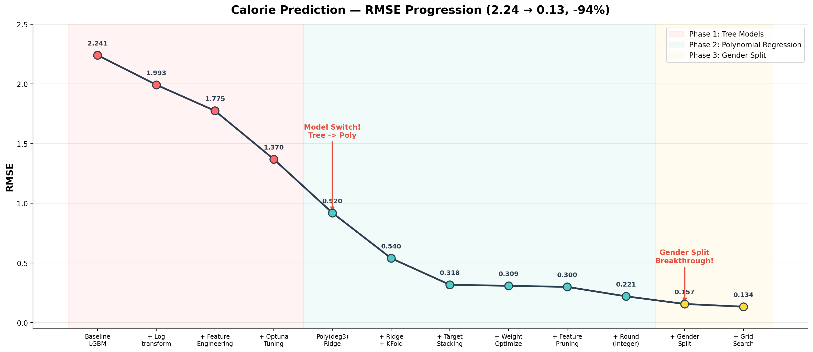
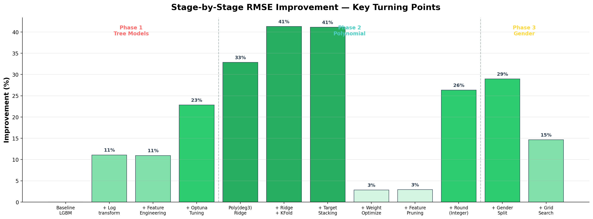
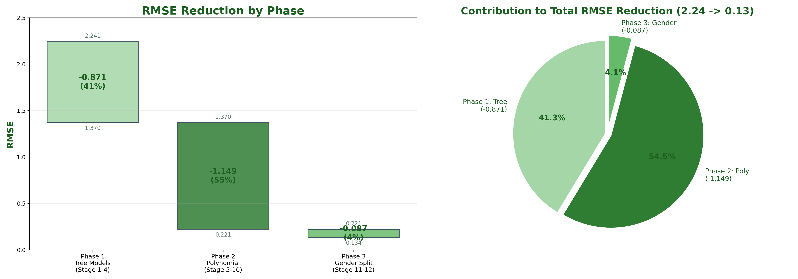

# 🔥 Calorie Prediction 

운동 데이터 기반 칼로리 소모량 예측 프로젝트

**RMSE 2.24 → 0.13 (94% 감소) | 리더보드 0.12**
Final OOF RMSE: 0.134
Key Insight: Tree → Polynomial 전환 + Residual 구조 분석 + Gender Split


---

## 프로젝트 개요

| 항목 | 내용 |
|------|------|
| 목표 | 운동 데이터(심박수, 운동시간, 체온 등)로 칼로리 소모량 예측 |
| 데이터 | Train 7,500 / Test 7,500 (10개 피처, 타겟: Calories_Burned) |
| 최종 모델 | 성별 분리 + Polynomial(deg 2) + Ridge Regression |
| 평가 지표 | RMSE |
| OOF RMSE | **0.134** |
| 리더보드 | **0.12** |

---

## 핵심 인사이트

**1. 모델 전환이 가장 큰 개선을 가져옴**
- 트리 모델(LightGBM)은 RMSE 1.37에서 정체
- Polynomial Regression 전환 후 0.92로 즉시 33% 개선
- 칼로리 = Duration × BPM × Temp 같은 **곱셈 구조**를 Polynomial이 직접 학습

**2. 피처를 줄이는 것이 더 효과적**
- 23개 파생변수 → 5개 핵심 변수만 사용 시 오히려 성능 향상
- Polynomial 조합 폭발(2599개)로 인한 분산 증가를 방지

**3. 데이터 구조에 맞는 분리가 핵심**
- 잔차 분석으로 남/여 칼로리 소모 공식이 다르다는 것을 발견
- 성별 분리 모델로 RMSE 0.30 → 0.13 (57% 개선)

---

## 최종 모델 구성

```
Features: [Exercise_Duration, BPM, Temp_diff, Age, Weight(lb)]
          (Temp_diff = Body_Temperature - 98.6°F)

Pipeline:  Gender Split → PolynomialFeatures(deg=2) → StandardScaler → Ridge → Round

           ┌─ Male:   Poly(deg=2) + Ridge(α=1e-06)  → OOF RMSE 0.137
Data ──────┤
           └─ Female: Poly(deg=2) + Ridge(α=7.6e-04) → OOF RMSE 0.130
                                                        ───────────────
                                                 Total: OOF RMSE 0.134
```

---

## 성능 추이

| # | 단계 | 모델 | RMSE | 개선율 | 핵심 기법 |
|---|------|------|------|--------|----------|
| 1 | Baseline | LGBM | 2.241 | - | 4모델 비교 |
| 2 | + Log transform | LGBM | 1.993 | 11% | 분포 보정 |
| 3 | + 파생변수 | LGBM | 1.775 | 11% | Intensity, Effort |
| 4 | + Optuna | LGBM | 1.370 | 23% | 하이퍼파라미터 |
| 5 | **Poly(deg 3)** | **Ridge** | **0.920** | **33%** | **모델 전환** |
| 6 | + Ridge + KFold | Ridge | 0.540 | 41% | 규제 + CV |
| 7 | + 타겟 변환 스태킹 | Stacking | 0.318 | 41% | log/sqrt/YJ 결합 |
| 8 | + 가중치 최적화 | Stacking | 0.309 | 3% | scipy optimize |
| 9 | + Feature pruning | Ridge | 0.300 | 3% | base + TOP5 |
| 10 | + Round | Ridge | 0.221 | 26% | 정수 타겟 반영 |
| 11 | **+ 성별 분리** | **Ridge** | **0.157** | **29%** | **M/F 분리** |
| 12 | **+ Grid Search** | **Ridge** | **0.134** | **15%** | **deg/α 최적화** |





---

## 프로젝트 구조

```
calorie-prediction/
│
├── README.md
│
├── notebooks/                          # 주요 실험 노트북 (5개)
│   ├── 01_EDA.ipynb                    # 탐색적 데이터 분석
│   ├── 02_Baseline_Tree_Model.ipynb    # DT/RF/XGB/LGBM 비교
│   ├── 03_Polynomial_Experiment.ipynb  # Poly + Ridge + 스태킹
│   ├── 04_Model_Refinement.ipynb       # 잔차 분석 + 성별 분리 발견
│   └── 05_Final_Model.ipynb            # 최종 모델 (RMSE 0.13)
│
├── archive/                            # 실험 기록 (19개)
│   ├── baseline_4model_comparison.ipynb
│   ├── baseline_feature_engineering.ipynb
│   ├── baseline_seed5_ensemble.ipynb
│   ├── calories_burned_model_ver2(xgboost_optuna_tuning).ipynb
│   ├── calories_burned_model_ver3(lgbm_xgb_ensemble).ipynb
│   ├── calories_burned_ver5(polynomial_first_attempt).ipynb
│   ├── calories_burned_ver6_kfold(poly_kfold_alpha_tuning).ipynb
│   ├── calories_burned_ver6.2(poly_degree2_weight_features).ipynb
│   ├── calories_burned_ver6.3(poly_degree3_kfold_ridge).ipynb
│   ├── calories_burned_ver6.4(poly_outlier_experiment).ipynb
│   ├── calories_burned_ver6.7(target_transform_stacking).ipynb
│   ├── calories_burned_ver6.9(feature_pruning_top5).ipynb
│   ├── calories_burned_ver6.9(weight_optimization_scipy).ipynb
│   ├── calories_burned_ver7(identity_sqrt_ridge_blend).ipynb
│   ├── calories_burned_ver7_d4(degree4_mlp_experiment).ipynb
│   ├── calories_burned_ver7_lgbm(lightgbm_keyser_formula).ipynb
│   ├── calories_burned_ver8(residual_analysis_multiply_structure).ipynb
│   ├── calories_burned_ver8.1(gender_split_first_attempt).ipynb
│   └── calories_burned_ver8.3(gender_split_grid_search_final).ipynb
│
├── data/
│   └── raw/
│       ├── train.csv
│       └── test.csv
│
├── results/
│   ├── model_comparison.csv            # 12단계 성능 데이터
│   └── plots/
│       ├── rmse_progression.png        # RMSE 변화 추이
│       ├── improvement_by_stage.png    # 단계별 개선율
│       └── phase_summary.png           # Phase별 기여도
│
└── src/
    ├── preprocessing.py
    ├── feature_engineering.py
    ├── train.py
    └── inference.py
```

---

## 노트북 설명

### 01_EDA — 탐색적 데이터 분석
5단계 체계적 분석으로 데이터 구조를 파악하고 모델링 방향을 설정
- 결측치 0, 중복 0 확인
- 타겟 우측 편향(skew 0.82) → 로그 변환 필요성 발견
- 핵심 변수: Exercise_Duration(0.955), BPM(0.900), Body_Temp(0.824)
- Height, Weight 단독 설명력 거의 없음 → 상호작용 항 필요

### 02_Baseline_Tree_Model — 트리 모델 비교
4종 트리 모델 비교 → LGBM 채택 → 단계적 개선 → 한계 확인
- DT → RF → XGBoost → **LightGBM** 순으로 성능 향상
- 로그 변환 + 파생변수(Intensity, Effort) + Optuna 하이퍼파라미터 튜닝
- Seed Ensemble(5 seeds)로 안정성 향상
- **RMSE ~1.37에서 정체 → Polynomial 전환 결정**

### 03_Polynomial_Experiment — 다항 회귀 실험
Polynomial 도입부터 타겟 변환 스태킹까지의 핵심 실험
- Poly degree 1/2/3 비교: degree 3에서 RMSE 0.92 (33% 개선)
- Ridge 규제 + KFold: RMSE 0.54
- **타겟 변환 다양화 스태킹**: 동일 모델 × 다양한 타겟(log, sqrt, Yeo-Johnson, raw) → RMSE 0.318
- scipy 가중치 최적화: RMSE 0.309
- Feature pruning (base + TOP5): 노이즈 제거

### 04_Model_Refinement — 모델 정교화
잔차 분석으로 데이터의 근본 구조를 파악하고 성별 분리를 발견
- identity/sqrt Ridge 결합 + 정수 반올림 → RMSE 0.221
- **잔차 분석**: 변수 간 곱셈 구조(Duration × BPM × Temp_diff) 확인
- **성별별 잔차 분포가 다름** → 남/여 분리 모델의 근거
- 대안 모델(MLP, LightGBM+Keyser 공식) 탐색 → 효과 미미

### 05_Final_Model — 최종 모델
성별 분리 + 핵심 5변수 + Poly(deg 2) + Ridge + Round
- 핵심 5변수: Exercise_Duration, BPM, Temp_diff, Age, Weight(lb)
- 성별별 (degree, alpha) 그리드 탐색 (OOF round RMSE 기준)
- **OOF RMSE: 0.134 / 리더보드: 0.12**

---

## 사용 기술

- **Python** (NumPy, Pandas, Scikit-learn, SciPy)
- **모델**: Polynomial Regression + Ridge (L2 Regularization)
- **검증**: 5-Fold Cross Validation (OOF)
- **최적화**: Grid Search, Optuna, scipy.optimize
- **트리 모델**: LightGBM, XGBoost (초기 실험)
- **시각화**: Matplotlib, Seaborn

---

## 실행 방법

```bash
# 1. 데이터 준비
# data/raw/ 에 train.csv, test.csv 배치

# 2. EDA 확인
jupyter notebook notebooks/01_EDA.ipynb

# 3. 최종 모델 실행
jupyter notebook notebooks/05_Final_Model.ipynb
# → submit_gender_best.csv 생성
```

---

## 주요 교훈

1. **모델 선택 > 하이퍼파라미터 튜닝**: 트리→Poly 전환이 Optuna보다 더 큰 개선
2. **피처 엔지니어링은 양날의 검**: Polynomial에서는 피처가 적을수록 오히려 좋음
3. **데이터 구조 분석이 핵심**: 잔차 분석 → 곱셈 구조 발견 → 성별 분리 → 최대 개선
4. **후처리도 중요**: 정수 반올림만으로 RMSE 26% 개선
5. **실험 기록 남기기**: 19개 실험의 시행착오가 최종 모델의 근거가 됨
